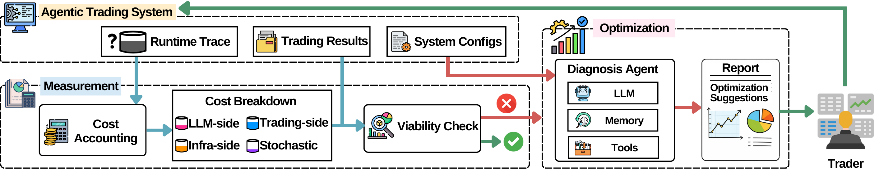

# FinCost-Demo

Cost and performance reporting for LLM-driven trading backtests.


## What It Does

`FinCost` loads experiment records and static config, calculates trading costs
(commission, token usage, infra, monthly subscription, and an uncertain add-on),
then outputs summary reports, charts, and optional diagnosis notes.



## Quick Start (uv)

1. Create and activate a virtual environment:
   - `uv venv`
   - `source .venv/bin/activate`
2. Install dependencies:
   - `uv pip install -e .`
3. Configure inputs:
   - `config.json` points to the experiment records and static config
   - `config_llm.json` contains per-model token pricing
   - Optional: copy `env.example` to `.env` to enable diagnosis
4. Run:
   - `python main.py`

## Quick Start (pip)

1. Create and activate a virtual environment:
   - `python -m venv .venv`
   - `source .venv/bin/activate`
2. Install dependencies:
   - `pip install -r requirements.txt`
3. Configure inputs:
   - `config.json` points to the experiment records and static config
   - `config_llm.json` contains per-model token pricing
   - Optional: copy `env.example` to `.env` to enable diagnosis
4. Run:
   - `python main.py`

## Inputs

- `config.json`
  - `records_path`: JSONL experiment records
  - `static_path`: JSON-like static config (relaxed JSON allowed)
  - `prices_path`: daily price JSONL (used for portfolio valuation)
  - `agent_model`: LLM model for diagnosis (optional)
  - `llm_call_success_rate`: scales token costs (optional, default `1.0`)
- `config_llm.json`
  - `unit` must be `per_1k_tokens`
  - `models` pricing with input/output/cache rates
- `data/*.jsonl`
  - Records include `date`, `model` or `llm_usage.model`, `llm_usage` token fields,
    and `trades` with `decision_type`, `ticker`, `quantity`, and prices.
  - Optional trade timestamps (`trades[].timestamp.analysis_time` and
    `trades[].timestamp.decision_time`) enable latency reporting.
  - Records may include `llm_usage.latency_ms` and `tool_usage` for diagnosis.
  - Static config includes `structure` plus fields like `llm_model`,
    `initial_cash`, `decision_frequency` (or `frequency`), and
    `data_subscription_monthly`. Optional: `start_time`, `end_time`,
    `strategy_id`/`signature`.

## Diagnosis (Optional)

The diagnosis agent summarizes cost drivers and improvement suggestions and
renders an HTML report if a provider is configured.

- Copy `env.example` to `.env` and set either:
  - `OPENAI_API_KEY`, or
  - `AIHUBMIX_API_KEY` + `AIHUBMIX_BASE_URL`
- `agent_model` in `config.json` selects the LLM.

## Example Configs

`config.json`:
```json
{
  "records_path": "data/exp-3/experiment_records_gpt-5.2_10000.0_2025-12-01-10-00-00_2025-12-31-15-00-00.jsonl",
  "static_path": "data/exp-3/static-gpt-5.2_10000.0_hourly_2025-12-01-10-00-00_2025-12-31-15-00-00.jsonl",
  "prices_path": "data/merged.jsonl"
}
```

`config_llm.json`:
```json
{
  "currency": "USD",
  "unit": "per_1k_tokens",
  "models": {
    "gpt-5.2": {
      "input_price_per_k_tokens": 0.00175,
      "output_price_per_k_tokens": 0.014,
      "cache_price_per_k_tokens": 0.000175
    }
  }
}
```

## Outputs

Results are written under `result/<llm_model>-<initial_cash>-<frequency>/`:

- `*.txt` report with action summary and cost totals
- `*.jsonl` report payload
- `*-bill.md` summary bill markdown
- `*-bill.md.html` bill rendered as HTML
- `*-bill-diagnosis.md` diagnosis markdown (when enabled)
- `*-bill-diagnosis.md.html` diagnosis rendered as HTML
- `pie-chart/*.pdf` cost breakdown (with/without monthly)
- `line chart/*.pdf` performance vs costs (with/without monthly)

## Tools

- `tools/daily-hourly-compare.py` aggregates daily costs for hourly vs daily
  experiments and writes `tools/daily-hourly-compare-output.jsonl`.

## Notes

- `main.py` at repo root delegates to `FinCost.main`.
- Infra cost is fixed at `0.2` per trading day.
- Uncertain cost is randomly sampled in `FinCost.main`.
- Commission uses IB Fixed pricing (per share, min, max).
- `llm_call_success_rate` in `config.json` scales token costs.
- `calculator.py` is a standalone demo script (legacy; `main.py` is preferred).

